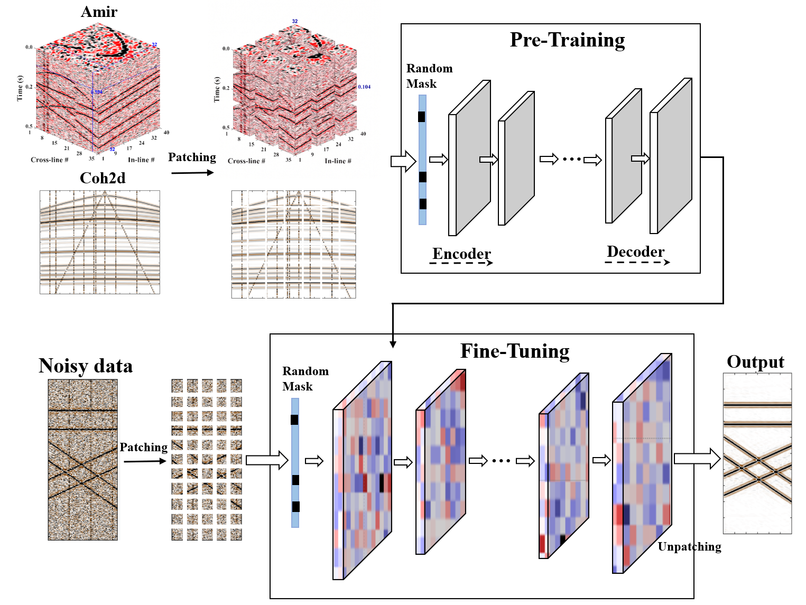

# Pre-trained Foundation Model for Uncorrelated Noise Attenuation of Seismic Data

[](https://champyin.com)

**Pre-trained Foundation Model** is a seismic denoising method built on foundation models with sparse attention networks. Pre-trained on abundant open seismic datasets, the model has strong generalization. In practical use, it only needs a small amount of data for quick fine-tuning. It cuts model parameters and improves engineering efficiency.

# :star:  Overview

## Existing AI denoising approaches require retraining for different datasets, which leads to excessive computational redundancy and limited generalization ability. This model adopts sparse attention and pre-training strategies and mainly includes four modules below.
 - Step 1: Data Preparation: Both synthetic seismic data and field seismic data are processed into patches, with zero-padding applied to boundary regions. In the pre-trained stage the dataset is split into training and validation sets at a ratio of 8:2. All data are converted to float32 format, and a TensorDataset is constructed for model training.
 - Step 2: Pre-training: We use a two-stage pre-training strategy. First, we train the model for several epochs on massive open datasets. The model roughly learns the features of seismic waves. We save the best training weights to provide better initial parameters for the next training step. Then, we train the model for another several epochs based on the saved weights. This step enables the model to learn detailed seismic wave features and output the final pre-trained weights.
 - Step 3: Fine-tuning:On the basis of the final pre-trained weights, we train the model on target datasets with only a small number of epochs.
 - Step 4:Inference and Validation: The optimal model weights obtained during training are loaded to perform patch-wise inference on noisy seismic data, and then the patched results are merged into complete denoised seismic data through inverse patch transformation. Quantitative indicators such as Signal-to-Noise Ratio (SNR) are calculated to conduct quantitative evaluation on the denoising effect of the model.` Median Filter`, `Pre-trained Foundation Model` and `PatchUnet` are adopted to test and compare the denoising performance.
--The trained network parameters are saved as `xx.pth` file
---
- `data`：All **data** is stored in this folder, including: `Amirsyn.mat`,`Amirsyn2d.mat`,`seis2dsyn.mat`, `seis3dsyn.mat`, `real2d.mat`, `real3d.mat`

|name     |data size|Patch size|Slid size|Patches|
| :--------|:--- | :----- | :-------- |:-------- |
|Amirsyn2d + Coh2d| 500 $\times$ 700   |   30 $\times$ 30   | 4 $\times$ 4   |23283 |
|Amirsyn| 500 $\times$ 35 $\times$ 40 |  12 $\times$ 12 $\times$ 12 | 4 $\times$ 2 $\times$ 2 |23985 |
|seis2dsyn| 512 $\times$ 64   |   30 $\times$ 30   | 1 $\times$ 1   |16905 |
|seis3dsyn| 401 $\times$ 64 $\times$ 64 |  12 $\times$ 12 $\times$ 12 | 3 $\times$ 1 $\times$ 1 |367979 |
|real2d   |512 $\times$ 128   |   30 $\times$ 30   | 1 $\times$ 1   |47817 |
|real3d   |256 $\times$ 64 $\times$ 48 |  12 $\times$ 12 $\times$ 12 | 3 $\times$ 1 $\times$ 1 |162763 |
#  :rocket:  File Description
- `Fine-tuning`：Both the denoising networks of Pre-trained Foundation Model during the fine-tuning stage for synthetic data and field data are stored here, including both 2D and 3D versions.
- `PatchUnet`：Both the denoising networks of PatchUnet for synthetic data and field data are stored here, including both 2D and 3D versions.
- `medianFilter`：Both the denoising networks of Median filter for synthetic data and field data are stored here, including both 2D and 3D versions.
 :boom: **Note Only one type of seismic data is presented here. If you are interested in other datasets, you can replace the corresponding input `.pth` model parameters and patch data  `D_patch` .** 
 
# The network structure of the pre-trained stage is shown below:

# The network structure of the fine-tuning stage is shown below:

# :hotsprings: Example
## (1) Loading the .mat Data 
- All data is stored in .mat format. You can run this script to convert the format from` MATLAB `->` Python`.
```makedown
import scipy.io as sio
data = sio.loadmat('syn2dsyn.mat')
Dc = data['DataClean']
Dn = data['DataNoisy']
```
# :memo: Taking synthetic 2D seismic data as an example
- The figure below shows the clean data and the data contaminated by irrelevant noise. It contains one set of horizontal events and two sets of intersecting dipping events. The code for plotting the above results is stored in the folder named plotting.

## (2) Environment Setup
This seismic denoising model uses Python 3.11.14 with fixed package versions for full reproducibility.
Basic Info
Python: 3.11.14, PyTorch: 2.2.2
Install Environment
### Step1: Create virtual environment
```makedown
conda create -n denoise python=3.11.14
```
### Step2: Activate environment
```makedown
conda activate denoise
```
### Step3: Manual one-line installation
```makedown
pip install torch==2.2.2 numpy==1.26.0 scipy==1.16.3 pandas==3.0.0 matplotlib==3.10.8 h5py==3.16.0 scikit-learn==1.8.0 tqdm==4.67.3 PyYAML==6.0.3 networkx==3.6.1 sympy==1.14.0 pillow==11.1.0 requests==2.32.5 jupyterlab==4.5.0 -i https://pypi.tuna.tsinghua.edu.cn/simple
```
### Step4:  Run this code to verify core packages:
```makedown
import sys, torch, numpy, scipy, pandas, h5py
print(f"Python: {sys.version.split()[0]}")
print(f"Torch: {torch.__version__}, Numpy: {numpy.__version__}")
print(f"Scipy: {scipy.__version__}, Pandas: {pandas.__version__}, H5py: {h5py.__version__}")
```
Notes
NVIDIA GPUs with CUDA 11.8 / 12.1 are supported for acceleration. CPU execution is available but much slower.
Do not upgrade core libraries like torch, numpy and scipy, otherwise API changes may cause runtime errors.
## (3) Run fine-tuned syn2d.ipynb:
`data = sio.loadmat('seismic_snr_-4dB.mat')`

If you need to add data, you may modify the file within the parentheses.

After running the program, you will obtain the following files:

- best_model_30,30_final.pth
- syn2d_best_Fine-tune training.pth
- syn2d_best_Fine-tune training.mat
  
`Among them, the first file stores the optimal pre-trained network and its corresponding parameters; the second file contains the network parameters after fine-tuning; the third file records the denoising outputs generated by the fine-tuned network. Similarly, we can adopt other codes to implement denoising methods such as median filtering and PatchUNet for comparative denoising results.`
## (4) Visualization of Denoising results:

All data are saved in .mat format, and the data can be plotted using `Plotfigure.m`

# :sunrise_over_mountains: Maintainer
Chao Fu

For any questions regarding the dataset, `pth` or scripts, please open an issue in this repository.
